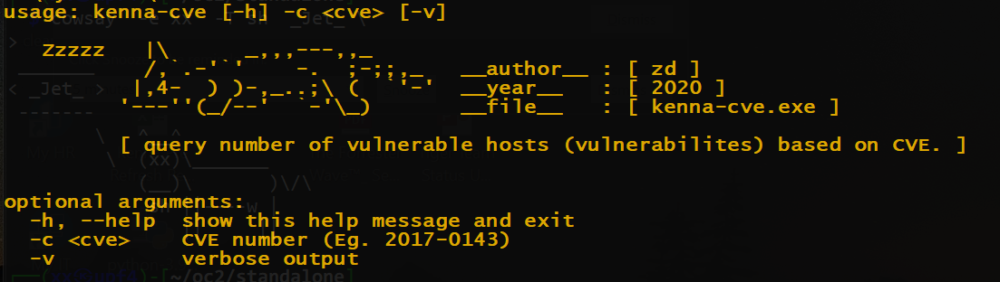
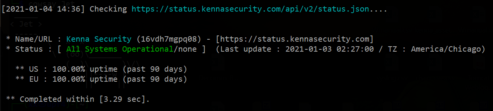

# Kenna Security REST API

This isn't the official scripts from KennaSecurity. The official Kenna Security REST API can be found at https://github.com/KennaPublicSamples/All_Samples

Here, I share some of the scripts to help manage some quick tasks using the Kenna Security RESTful API. For more information, please see: https://api.kennasecurity.com. And I do share some searching tips for references.

Note that, before you start, you have to obtain a 64 bytes API key as a token from Kenna administrator. Here's the instruction to store your token API key (in Windows platform) for the script:
1. At the command prompt, cmd.exe, go to the same folder where your EXE stays.
2. Type " notepad token ", and paste the key into the new file.
3. At the command prompt, type " ren token.txt token.api".
4. (I tried "echo zxcasder....ABCdef123890 > token.api" and it just don't work)

### :octocat: asset-search-cve.py :snake:
To search an asset by either hostnames or IP address. This is useful for searching assets with matching CVE. 

### :octocat: connector-history.py :snake:
> To list all the current connectors and the last sync history. This is useful to show all the success/failure syncs for all connectors.

### :octocat: kenna-cve :snake: (win32)
> To query the number of vulnerable hosts (and vulnerabilites) based on CVE ID.

### :octocat: kenna-status :snake:
> To check the KennaSecurity status at https://status.kennasecurity.com

### :octocat: list-user.rb :gem::
To list all the users. This is useful to obtain a list of users including YOURSELVES. It is strange enough that KennaSecurity can never show yourself in the GUI.

### :octocat: show-meter.py :snake:
To show the current count in a list of meters.

### :open_file_folder: tips
> Some tips on KennaSecurity search syntax.

